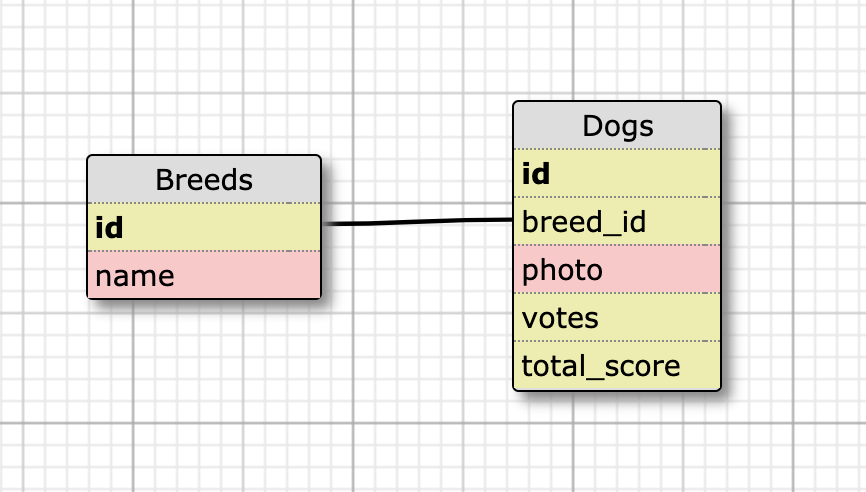

# Dog-Gone-Cute - Backend

## Introduction
Dog-Gone-Cute is a 100% test-covered Rails application that provides multiple API endpoints for a front-end JavaScript/node.js application by the same name (https://github.com/bdiveley/dog_gone_cute_fe).  The combined applications provide a fun way to waste a few hours by rating the cuteness level of randomly selected dogs.

## Project Board
https://github.com/bdiveley/dog_gone_cute/projects/1

## Setup (from CLI)
* git clone git@github.com:bdiveley/dog_gone_cute.git
* bundle install
* rake db:{drop,create,migrate,seed}
* rails s (will spin up local server at localhost:3000)
* Use browser to visit simple 'GET' endpoints or utilize Postman(https://www.getpostman.com/)
* rails c (gives CLI access to local instance of database)

## Running Tests (from CLI)
* rails s (will spin up local server)
* rspec (will run all tests in /spec directory)

## Database Schema


## Production Base URL
```shell
https://morning-refuge-91147.herokuapp.com/
```

## Local Base URL
```shell
http://localhost:3000
```

## Endpoints

**Request**
```shell
GET /api/v1/dogs?order=desc
```

**Response**
```shell
{:data=>
  [{:id=>"603",
    :type=>"dog",
    :attributes=>{:id=>603, :breed_id=>641, :photo=>"https://images.dog.ceo/breeds/beagle/n02092002_14567.jpg", :ave_score=>87.0}},
   {:id=>"601",
    :type=>"dog",
    :attributes=>{:id=>601, :breed_id=>639, :photo=>"https://images.dog.ceo/breeds/chow/n02092002_14567.jpg", :ave_score=>30.0}},
   {:id=>"600",
    :type=>"dog",
    :attributes=>{:id=>600, :breed_id=>638, :photo=>"https://images.dog.ceo/breeds/deerhound-scottish/n02092002_14567.jpg", :ave_score=>9.11111111111111}},
   {:id=>"599",
    :type=>"dog",
    :attributes=>{:id=>599, :breed_id=>637, :photo=>"https://images.dog.ceo/breeds/bouvier/n02092002_14567.jpg", :ave_score=>6.58333333333333}},
   {:id=>"602",
    :type=>"dog",
    :attributes=>{:id=>602, :breed_id=>640, :photo=>"https://images.dog.ceo/breeds/affenpinscher/n02092002_14567.jpg", :ave_score=>2.1875}}
  ]
}
```
**Request**
```shell
GET /api/v1/dogs?order=asc
```

**Response**
```shell
{:data=>
  [{:id=>"588",
    :type=>"dog",
    :attributes=>{:id=>588, :breed_id=>626, :photo=>"https://images.dog.ceo/breeds/deerhound-scottish/n02092002_14567.jpg", :ave_score=>0.611111111111111}},
   {:id=>"587",
    :type=>"dog",
    :attributes=>{:id=>587, :breed_id=>625, :photo=>"https://images.dog.ceo/breeds/chow/n02092002_14567.jpg", :ave_score=>0.642857142857143}},
   {:id=>"590",
    :type=>"dog",
    :attributes=>{:id=>590, :breed_id=>628, :photo=>"https://images.dog.ceo/breeds/beagle/n02092002_14567.jpg", :ave_score=>2.54545454545455}},
   {:id=>"586",
    :type=>"dog",
    :attributes=>{:id=>586, :breed_id=>624, :photo=>"https://images.dog.ceo/breeds/bouvier/n02092002_14567.jpg", :ave_score=>3.06666666666667}},
   {:id=>"589",
    :type=>"dog",
    :attributes=>{:id=>589, :breed_id=>627, :photo=>"https://images.dog.ceo/breeds/affenpinscher/n02092002_14567.jpg", :ave_score=>5.57142857142857}}
  ]
}
```
**Request**
```shell
GET /api/v1/dogs/search?breed=chow&order=desc
```

**Response**
```shell
{:data=>
  [{:id=>"1080",
    :type=>"dog",
    :attributes=>{:id=>1080, :breed_id=>1081, :photo=>"https://images.dog.ceo/breeds/deerhound-scottish/n02092002_14567.jpg", :ave_score=>4.46666666666667}},
   {:id=>"1079",
    :type=>"dog",
    :attributes=>{:id=>1079, :breed_id=>1081, :photo=>"https://images.dog.ceo/breeds/deerhound-scottish/n02092002_14567.jpg", :ave_score=>1.0}}
  ]
}
```

**Request**
```shell
GET /api/v1/dogs/search?breed=chow&order=asc
```

**Response**
```shell
{:data=>
  [{:id=>"1085",
    :type=>"dog",
    :attributes=>{:id=>1085, :breed_id=>1085, :photo=>"https://images.dog.ceo/breeds/deerhound-scottish/n02092002_14567.jpg", :ave_score=>3.5}},
   {:id=>"1084",
    :type=>"dog",
    :attributes=>
     {:id=>1084, :breed_id=>1085, :photo=>"https://images.dog.ceo/breeds/deerhound-scottish/n02092002_14567.jpg", :ave_score=>4.677}}
  ]
}
```

**Request**
```shell
POST /api/v1/dogs
Body: { "photo": "https://images.dog.ceo/breeds/deerhound-scottish/n02092002_14567.jpg",
  "score": "3"
}
```

**Response**
```shell
{:data=>
  {:id=>"1573",
   :type=>"dog",
   :attributes=>{:id=>1573, :breed_id=>1525, :photo=>"https://images.dog.ceo/breeds/deerhound-scottish/n02092002_14567.jpg", :ave_score=>3.0}
 }
}
```

## Built With
* JavaScript
* Node.js
* CSS
* HTML
* AJAX
* JQuery

## Developer
Bailey Diveley
bdiveley (GitHub)
